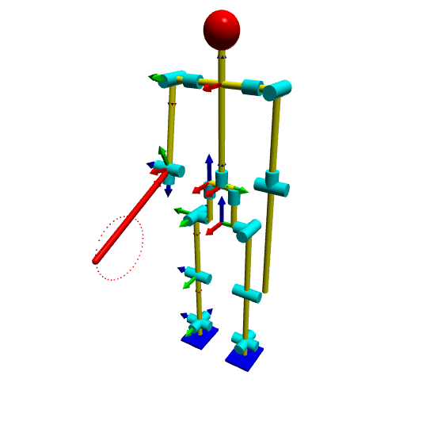

# Vpython_Robo

## Requirements

* python 3.10
* pip
* vpython

## Installing vpython

> pip install vpython

## Visualization

The right coordinate system of the humanoid robot will be displayed, and the right arm will move around the preset circle. More actions can be added by imitating the method in the code.
